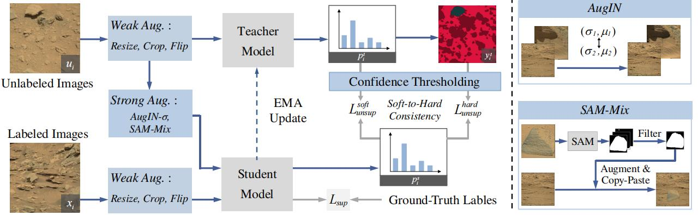

### Abstract

Deep learning has become a powerful tool for Mars exploration. Mars terrain semantic segmentation is an important Martian vision task, which is the base of rover autonomous planning and safe driving. However, there is a lack of sufficient detailed and high-confidence data annotations, which are exactly required by most deep learning methods to obtain a good model. To address this problem, we propose our solution from the perspective of joint data and method design. We first present a new dataset S5Mars for Semi-SuperviSed learning on Mars Semantic Segmentation, which contains 6K high-resolution images and is sparsely annotated based on confidence, ensuring the high quality of labels. Then to learn from this sparse data, we propose a semi-supervised learning (SSL) framework for Mars image semantic segmentation, to learn representations from limited labeled data. Different from the existing SSL methods which are mostly targeted at the Earth image data, our method takes into account Mars data characteristics. Specifically, we first investigate the impact of current widely used natural image augmentations on Mars images. Based on the analysis, we then proposed two novel and effective augmentations for SSL of Mars segmentation, AugIN and SAM-Mix, which serve as strong augmentations to boost the model performance. Meanwhile, to fully leverage the unlabeled data, we introduce a soft-to-hard consistency learning strategy, learning from different targets based on prediction confidence. Experimental results show that our method can outperform state-of-the-art SSL approaches remarkably.

### Diagram



> The overview of the proposed framework for semi-supervised Mars semantic segmentation. We adopt a two-branch teacher-student architecture. Two novel augmentations are proposed as strong augmentations, AugIN and SAM-Mix. AugIN exchanges the statistics of the two samples, i.e., mean and standard deviation. SAM-Mix utilizes an off-the-shelf SAM to obtain the object binary masks to perform copy-paste operation, reducing the uncertainty of the augmented images. Finally, the model is optimized according to a soft-to-hard consistency learning strategy, utlizing both the soft labels and the hard labels based on the confidence.

## Running

### Prepare datasets

Please download the S5Mars dataset [here](https://drive.google.com/file/d/130R5z9v2NChVuseNDsH0zSTMolteELkO/view), and set up the path to them properly in the configuration files.

Meanwhile, the dir_path should be set properly in ./augseg/dataset/pku2mars.py.

### Prepare pre-trained encoder

Please download the pretrained models, and set up the path to these models properly in the file of `config_xxx.yaml` .

[ResNet-50](https://drive.google.com/file/d/1mqUrqFvTQ0k5QEotk4oiOFyP6B9dVZXS/view?usp=sharing)

Here is our adopted way，

```
├── ./pretrained
    └── resnet50.pth
```

### Prepare running Envs

Nothing special

- python: 3.7.13
- pytorch: 1.7.1
- cuda11.0.221_cudnn8.0.5_0
- torchvision:  0.8.2

### Ready to Run

Basically, you are recommanded to config the experimental runnings in a ".yaml" file firstly.
We include various configuration files under the directory of "exps".

```bash
# 1) configure your yaml file in a running script
vim ./scripts/run_mars_mix_distill.sh

# 2) run directly
sh ./scripts/run_mars_mix_distill.sh

```

## Citation

If you find these projects useful, please consider citing:

```bibtex
@ARTICLE{10499211,
  author={Zhang, Jiahang and Lin, Lilang and Fan, Zejia and Wang, Wenjing and Liu, Jiaying},
  journal={IEEE Transactions on Geoscience and Remote Sensing}, 
  title={S5Mars: Semi-Supervised Learning for Mars Semantic Segmentation}, 
  year={2024},
  volume={62},
  pages={1-15}
}
```

## Acknowledgement

We thank - [AugSeg](https://github.com/ZhenZHAO/AugSeg/) for the released codebases.
